# Повторная идентификация изображений людей
Задача распознавания повторных посетителей торговых центров по записям с видеокамер наблюдения, установленных на входах торговых центров с помощью сверточный нейросетей.  
Пример изображения с камеры:  

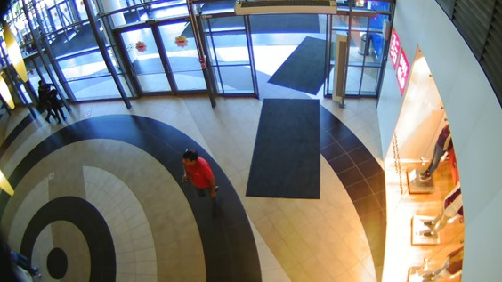

[Тетрадь](./notebooks/for_revision/verification.ipynb) с решением задачи.

# Пайплайн
Задача решалась с помощью следующей последовательности действий:  

1. Детектирование персон на видеозаписях
2. Трекинг персон
3. Получение фич изображений
4. Классификация и верификация

### Детектирование персон на видеозаписях
Для детектирования персон на кадрах была выбрана библиотека Darkflow (https://github.com/thtrieu/darkflow). Данная библиотека реализует алгоритм детекции YOLO (You Only Look Once), основанный на сверточной нейросети. Отличительной особенностью данного алгоритма является то, что ообработка всего кадра происходит в один проход. Это позволяет достигать скорости детекции 30-50 кадров в секунду на GPU типа GTX-1080. Архитектура сверточной сети представлена рисунке:  
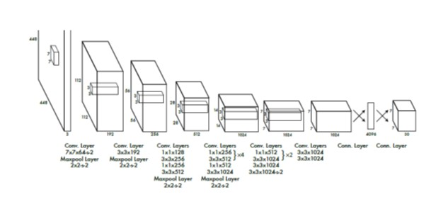   
Качество распознавания изображений нейросетью "из коробки" было неудовлетворительным ввиду низкого качества изображений с камер.  
Для дообучения использовалась выборка из 2600 размеченных кадров, содержащих в общей сложности около 7500 изображений персон. Обучающая выборка составила около 2100 кадров с 6000 размеченных персонами, тестовая – 500 кадров с 1500 персон.  

Была проведена серия экспериментов, в ходе которых обучалось различное количество слоев нейросети. Было выявлено, что наилучшие результаты получаются при обучении всех слоев сети с параметром learning rate 0.0001 – 0.00001. Ход обучения нейросети показан на рисунке ниже:    
  

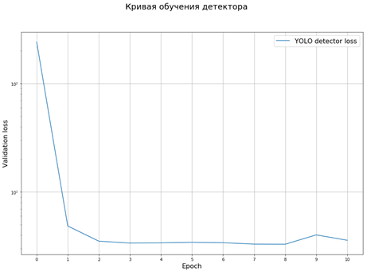  
В экспериментах функция потерь не претерпевала существенных изменений уже после первых нескольких эпох. В дальнейшем использованы веса модели, полученные в ходе последних 5 эпох обучения.
В результате дообучения модели удалось повысить качество распознавания до уровня (precision, recall) > (0.9, 0.9):  

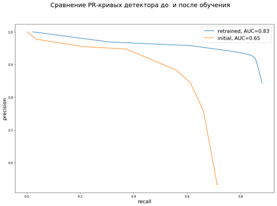  

### Трекинг персон
Трекинг персон для установления идентичности производился с помощью библиотеки SORT (https://github.com/abewley/sort). Данный алгоритм является классическим. Особенностью трекера является то, что он является мультиобъектным и должен обновляться на каждом шаге детекции. В решаемой задаче это являлось преимуществом, т.к. при потере детекции не происходило захвата трекером другого объекта, двигавшегося рядом с первоначальным объектом, что приводило бы в конечном итоге к смешиванию изображений разных персон в одном классе.  
В ходе обработки видео происходило следующее: детектор находил ограничивающие прямоугольники для персон в кадре, трекер присваивает им некоторые номера (id), которые сопровождают персону до тех пор, пока либо детекция, либо трекинг будут потеряны. Это позволяло получить серию изображений персоны с меняющимся ракурсом для последующей классификации. Сказанное поясняет рисунок:  

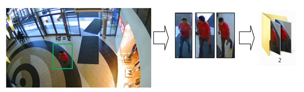

### Получение фич изображений
Для получения низкоразмерных свойств изображений испльзовалась сеть Inception, реализованная в Tensorflow (https://github.com/Hvass-Labs/TensorFlow-Tutorials/blob/master/inception.py). Данная нейросеть позволяет получить свойства размерности 2048. Для сравнения также использовалась сверточная сеть алгоритма DeepSort (https://github.com/nwojke/deep_sort) с выходной размерностью 128.

### Классификация и верификация
Для верификации изображений использовался метод Triplet Probabilistic Embedding (TPE), изложенный в (https://habrahabr.ru/post/317798/, https://arxiv.org/pdf/1604.05417.pdf)  

#### Краткое описание метода TPE

Суть метода состоит в следующем. Пусть дано множество векторов 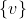, элементы которого принадлежат некоторому кол-ву классов. Пусть дана тройка векторов – низкоразмерных свойств трех изображений – триплет: 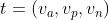. При этом вектора 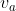 (anchor) и 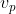 (positive) принадлежат к одному классу, а вектор  принадлежит к другому классу. Ищется такая функция *S*, что 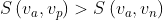 для всех триплетов множества . Зная эту функцию, для любого «неизвестного» вектора 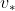 принадлежность к одному из известных классов *N* можно определить по критерию 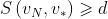, где d – параметр от 0 до 1. Кроме того, полученная таким образом функция *S* позволяет производить между собой верификацию изображений из классов *x* и *y*, которые не входили в обучающие данные, по тому же самому критерию: 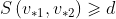 Таким образом, решение задачи верификации сводится к решению задачи классификации на ограниченном множестве. В качестве метрики расстояния можно взять функцию 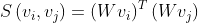, где *W* – матрица размером 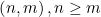. 
Основным параметром в задаче верификации является параметр d. В случае идеального разделения классов существует одно пороговое значении d, определяющее принадлежность любых двух векторов к одному или к разным классам. Однако, достичь идеального разделения на практике невозможно, и в задаче верификации вводится два понятия – False Acceptance Rate (FAR), и False Rejection Rate (FRR) – ошибки ложного отнесения к одному и разным классам, соответственно, которые зависят от параметра d. С увеличением параметра d величина FAR уменьшается, а FRR – возрастает. Сказанное поясняет рисунок:  
  
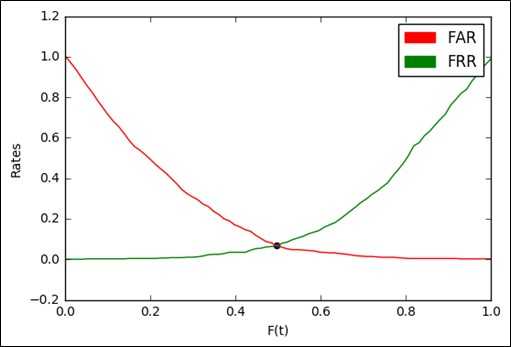  

Точка пересечения кривых FAR и FRR – точка равной ошибки – Equal Error Rate, EER – является объективным параметром качества модели верификации.  

Обучение TPE-модели происходит на низкоразмерных признаках, полученных на предыдущем шаге пайплайна. Функция потерь для данной модели:  
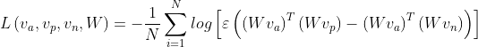  
где 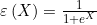, *N* - размер обучающей выборки.  

Для обучения TPE-верификатора использовалось 27196 примеров изображений, принадлежащих 709 различным персонам. Изображения разбивались на train/test выборки в соотношении 80/20. Результаты обучения представлены на рисунке:  
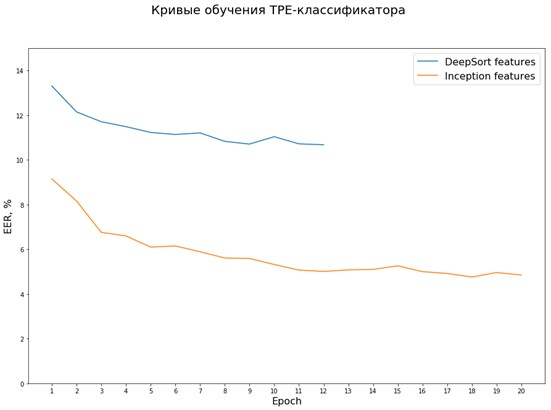  
Обучение на признаках модели Inception показало более высокие результаты с минимальным значением EER \~ 4%.  

# Тесты модели
Проведен ряд тестов обученной модели на изображениях как известных, так и неизвестных персон с целью определить target- и imposter- точность. Target- попытки – это тест на верификацию двух изображений, принадлежащих одной персоне, imposter- попытки – тесты на верификацию двух изображений разных персон.  
Кроме того, были проведены тесты на определение заведомо неизвестных персон.  

### Тест №1
В ходе первого теста проводились target- и imposter- тесты на изображениях уже известных классов персон. Данные классы персон участвовали в обучении модели, однако, target- и imposter- тесты проводились на изображениях, которые не были включены в обучающую выборку. Для каждого известного класса персон было отобрано по 5 изображений, которые не участвовали в обучении модели. В ходе target- тестов проводилось сравнение каждого изображения тестового класса с изображениями того же класса, которые участвовали в обучении модели. В ходе imposter- тестов проводилась верификация между тестовыми изображениям и тренировочными изображениями других классов. В случае, если при верификации одного изображения из тестовой выборки с изображениями обучающей выборки, принадлежащей некоторому классу, превышало некоторый порог, то считалось, что данное изображение верифицировано с изображениями данного класса. Пусть далее  

+ test_img – тестовое изображение  
+  С – класс, с которым мы проводим тестовую верификацию,  
+  N – количество элементов в классе C,  
+  M – количество верификаций изображения t_img с элементами класса N.  
+  Если M/N >= threshold: изображение t_img принадлежит классу C.  
  
Результат для threshold = 0.8:  

+ target-score: 95% (доля верно верифицированных изображений в своем классе)  
+ imposter-score: 1% (доля ошибочно верифицированных изображений для «чужих» классов).  

### Тест №2
В ходе теста было отобрано 50 случайных классов персон, которые не участвовали в обучении модели, причем среди этих 50 классов были персоны с обеих камер. Снова считаем, что все эти 50 персон полностью неизвестны для модели. 
Поскольку теперь для каждой из 50 персон есть целый набор изображений, полученных с камеры, необходимо создать критерий принадлежности по группе изображений. 
Использовалась модификация уже упомянутого критерия: берется каждое изображение неизвестной персоны и верифицируется с известными классами. Если процент верификаций для данного изображения больше порога, то мы считаем, что данное изображение идентифицировано с данным известным классом. Аналогичным образом поступаем с остальными изображениями неизвестной персоны. Если кол-во изображений неизвестной персоны, верифицированных в известном классе, больше некоторого порога, то считаем, что данная неизвестная персона идентифицирована с известным классом.
Была проведена оценка target- и imposter- показателей для выборки из 50 неизвестных персон, при этом target- попытки проводились только на множестве неизвстных 50 персон, а imposter- попытки – на множестве только известных персон.  
В результате проведенного теста, EER для target- и imposter- попыток составляет около 30%, что является достаточно низким показателем.  

### Тест №3
Из данных для 50 классов заведомо неизвестных персон были выбраны те, для которых кол-во изображений не меньше 30. Из выбранных классов были выбраны по 30 изображений и разделены на три группы по 10 изображений в каждой. Таким образом, для каждой неизвестной персоны получадся набор tpe-признаков вида: `[[набор1: 10 признаков],[набор2: 10 признаков],[набор3: 10 признаков]]`.  

Для каждого набора была проведена последовательная идентификация по следующему алгоритму:  

1. Если первый набор признаков не идентифицирован с известными классами, то считалось, что это данные для нового класса. Эти данные добавляются к набору известных классов, и счетчик новых персон увеличивается на 1.
2. Проводилась идентификация по второму набору из 10 признаков. Если верифицировалась принадлежность к верному классу - классу персоны из шага (1) - то счетчик успешной ре-идентификации для этой персоны увеличивался на 1.
3. Повторялся шаг (2), в случае, если снова был идентифицирован верный класс – увеличивался счетчик третьей верной идентификации на 1.

Качество работы модели оценивалось по доле верных идентификаций на каждом шаге.
Оценка проводилась при различных порогах распознавания внутри класса – от 0.5 до 0.9.
Результат теста приведен рисунке:  
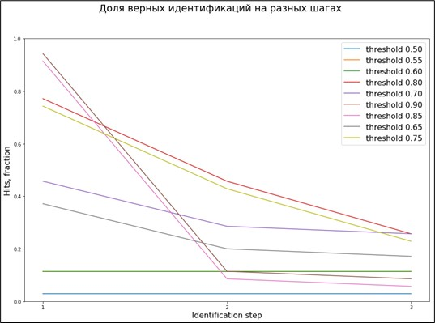  

Видно, что при увеличении порога доля верно определенных новых изображений на первом шге увеличивалась, однако, на последующих шагах она становилась меньше, чем для более низких порогов. Это связано с тем, что происходил слишком жесткий «отсев», и повторная идентификация не происходила. Также видно, что оптимальный с точки зрения средней по трем шагам доли верных идентификаций равен 0.75-0.8. В лучшем случае, после третьей идентификации качество ре-идентификации не превышало 25%.  

# Выводы

1. Дообучение детектора YOLO на изображения низкого качества эффективно осуществляется даже на маленьких выборках (первые тысячи изображений). Полученное качество детекции позволяет охватывать около 95% всех объектов в поле зрения камеры, что достаточно для ряда прикладных задач (например, подсчет общего количества посетителей, проходящих перед камерой).
2. 	TPE-модель позволяет получить достаточно высокое качество верификации (не более 5% target- и imposter- ошибок) на парах изображений при объеме обучающей выборки несколько десятков тысяч изображений низкого качества. При улучшении качества изображений можно ожидать более высоких результатов на меньших выборках.
3. 	Для качественной верификации персон по группе изображений необходимо искать оптимальный критерий верификации. Такими критериями могут выступать, например, пороговое значение доли верифицированных в одном классе изображений.
4. 	На качество верификации большое влияние оказывал выбор нейросети для извлечения низкоразмерных признаков. В рассмотренном варианте качество модели улучшилось в 2 раза при выборе нейросети Inception по сравнению с DeepSort.
5. 	На имеющихся данных и в реализованном варианте алгоритма точность повторных распознаваний не превышала 25% для трех шагов, что нельзя назвать высоким результатом. Однако, есть много точек, в которых алгоритм можно оптимизировать, например, выбирая только фронтальные изображения или иначе формируя данные для известных классов.
6. 	Вероятно, идентификация происходит в основном на цветовых фичах, поэтому смена цвета одежды может привести к существенному падению качества детекции (не проверялось в работе).

